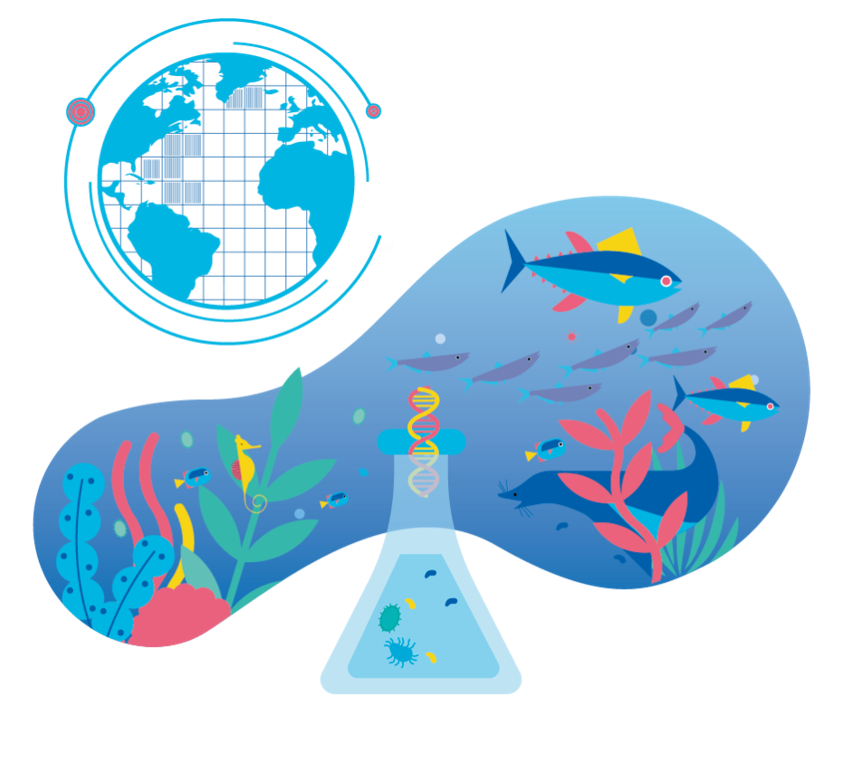
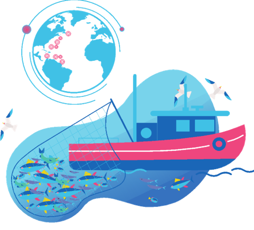
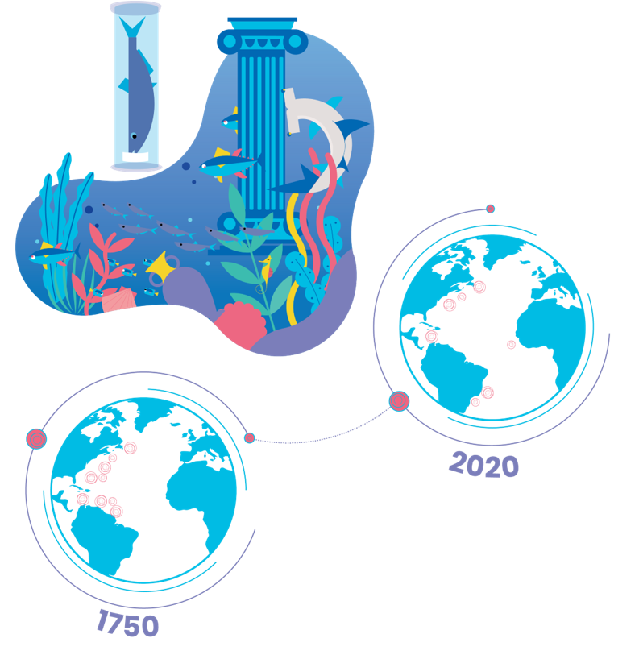
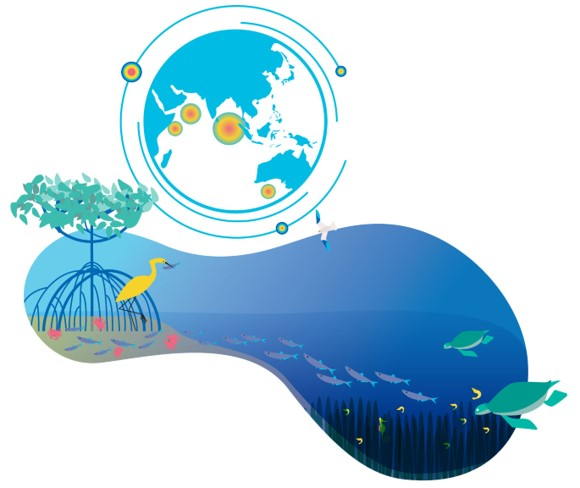
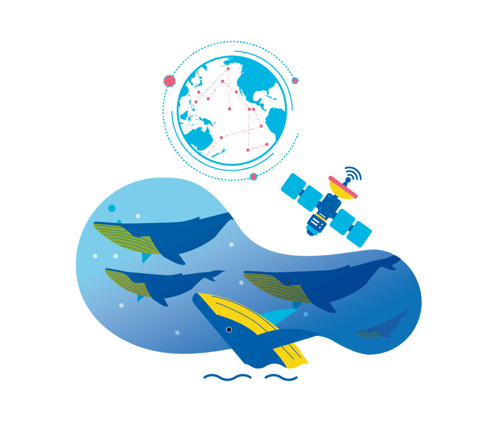

#### Before we start:

`robis` is a R package that allows users to query and retrieve data records from the Ocean Biodiversity Information System. It interfaces with the OBIS database using OBIS's API (which you could also leverage directly) and returns selected occurrences and co-occurring measurements from OBIS and its partner nodes worldwide.

Supplemental links and related materials:

- [OBIS guidelines on data sharing and use](https://obis.org/manual/policy/) - what OBIS's obligations are to its data providers and data consumers
- [Interactive web mapper for selecting OBIS-held data](https://mapper.obis.org) - another way to select and subset OBIS data
- [Darwin Core Quick Reference](https://dwc.tdwg.org/terms/) - a description of the data we're going to pull from OBIS and what its terms mean.

### The Ocean Biodiversity Information System
* Visit the [OBIS main site](https://obis.org).
* UNESCO / IOC / IODE initiative to aggregate and disseminate marine biodiversity data 
* HQ at VLIZ project office in Oostende, Belgium
* Comprised of national and thematic 'nodes' that publish datasets from providers to be aggregated into the global data system

### [OBIS Canada](https://obis.org/node/7dfb2d90-9317-434d-8d4e-64adf324579a)

* Run out of DFO Pacific Biological Station
* original home at DFO-BIO
* 2020 - went from 4 million to ~12 million records thanks to focused funding and effort of archivists at PBS.
* 2021 - still some data archiving funding, support available from OBIS Canada to arrange your dataset into OBIS-ready format (Darwin Core Archives).

### Kinds of data in OBIS

#### Presence/absence

These can originate from sporadic sightings or novel detection methods like environmental DNA.

#### Species counts and abundance data

The number of individuals within a given area or volume of seawater / sediment. Can be a key metric in conservation of vulnerable organisms and management of species populations.

#### Historical data

Historic records, preserved in archives, libraries, older data series.

#### Habitat data

Habitat data can be biological but also describe habitat and geographic diversity

#### Tracking data

Movement data that follows individual animals via satellites or bioacoustics.

OBIS provides guidance on how to generalize all of these kinds of data into Events and Occurrences and MeasurementsOrFacts, and describes them using a nomenclature called Darwin Core. Through its national and thematic partners, it aggregates Occurrences and the Events and MeasurementOrFacts that describe or accompany them into Darwin Core Archives. Those archives are the source data for the data system at the heart of OBIS.

#### Data standards and reference materials

OBIS datasets are held in [Darwin Core](https://dwc.tdwg.org/terms/) format, and are organized either with Occurrences at the center of [the schema](https://obis.org/manual/dataformat/#dwca), or via more recent recommendations, with Events as the core data type (see: [OBIS-ENV-DATA](https://obis.org/manual/dataformat/#emof) ). In this scheme, it is Events that generate knowledge of the Occurrences of species, and also biotic or abiotic MeasurementOrFacts about the Events and/or Occurrences.

### Contributing biodiversity data to OBIS

OBIS Canada is gathering a community of biological data creators and aggregators and coordinating them both on Microsoft Teams (within DFO) and [Slack](obiscanada.slack.com) (includes external data specialists from OGSL, CIOOS, OTN, Hakai, etc.). This community confers on how to apply OBIS standards to various data types, harmonizing efforts across Canada, and participates in the global-scope OBIS task teams for emergent data collection schemes - e.g. eDNA
### Browsing and incorporating OBIS data

We'll be using the R package `robis` today, and dealing just with Occurrences, but it's also possible to subset, filter, and create custom downloadable archives / data packages using https://mapper.obis.org 

### Time to open R / RStudio!

##### Querying OBIS for occurrence data
~~~
library(tidyverse)
library(robis)

# ?robis::occurrence
pbgl_df <- robis::occurrence('Lamna nasus')

View(pbgl_df)
~~~
{: .language-r}

##### Query OBIS for occurrence data using AphiaID
~~~

taxid <- robis::occurrence(taxonid=105841)
~~~
{: .language-r}

##### Selecting records within a geographic polygon:
We can make polygon notation (Well-Known Text) at https://obis.org/maptool/ or using any other WKT generator

NOTE: OBIS has a lot of records! A larger geometric range without any other filters can return millions of results! 
For designing and retrieving larger datasets, try https://mapper.obis.org

~~~
# Search in a box around the Atlantic and the GoSL:
gosl_df <- robis::occurrence('salmonidae', geometry = "POLYGON ((-59.85352 46.25585, 
                                                    -66.79688 43.51669, 
                                                    -65.83008 38.54817, 
                                                    -49.65820 38.54817, 
                                                    -48.42773 46.61926, 
                                                    -56.16211 54.16243, 
                                                    -71.45508 47.21957, 
                                                    -59.85352 46.25585))")

robis::map_leaflet(gosl_df)
~~~
{: .language-r}

Let's adjust the default map popup, as it isn't very useful to explore the data with. We can define a new popup with a bit of HTML:
~~~

robis::map_leaflet(gosl_df, 
            popup= function(x) {paste0('<a href="https://obis.org/dataset/', x['dataset_id'], '">',x['dataset_id'],'</a> ', 
                                       x['recordedBy'])}
            )
~~~
{: .language-r}

##### Applying other kinds of filters:

~~~

# Depth
roughy_shallow <- robis::occurrence("Hoplostethus atlanticus", enddepth=400)
robis::map_leaflet(roughy_shallow)

# Date
lionfish_native <- robis::occurrence("Pterois volitans", enddate="1980-01-01")
robis::map_leaflet(lionfish_native)

lionfish_now <- robis::occurrence("Pterois volitans")
robis::map_leaflet(lionfish_now)

~~~
{: .language-r}

You can also do normal dataframe and tidyverse things to your occurrence results, as the object's just a list. If you need to know the definition of any of the columns, they are all DarwinCore terms, and definitions can be found here: https://dwc.tdwg.org/terms/ 
~~~
# Inside your robis occurrences object:
names(gosl_df)

# A general idea of the results and the years they were observed
table(gosl_df$year)
~~~
{: .language-r}

##### MeasurementsOrFacts:
MoFs are related back to occurrence records via the occurrenceID for datasets that have Events, can find more data connected via EventID (i.e. when a sampling cruise also does CTD casting, ocean chemistry, etc.)

~~~
# furrow-shell mollusc
occ_w_mof <- robis::occurrence('Abra tenuis', mof=TRUE)

# get associated measurements to these occurrence records, keeping the fields
# specified in 'fields'
mof <- robis::measurements(occ_w_mof, fields=c('scientificName', 
                                               'decimalLongitude', 
                                               'decimalLatitude', 
                                               'eventDate'))

View(mof)
~~~
{: .language-r}

What are some of the measurement or facts that OBIS tracks?
see a full report and search for terms at https://mof.obis.org/

Notably:
* 7.2m records of 'fish length'
* 3.3m records of 'sampling protocol'

~~~
# Human-readable mof columns for our dataset:
mof %>% select('eventDate', 'decimalLongitude', 'decimalLatitude', 'measurementType', 'measurementValue') %>% View
~~~
{: .language-r}

~~~
# What if we need a specific type of measurement?
mof$measurementTypeID %>% unique()
~~~
{: .language-r}

MeasurementTypeIDs are URIs, which is handy, because we can visit e.g. [http://vocab.nerc.ac.uk/collection/P01/current/OBSINDLX/](http://vocab.nerc.ac.uk/collection/P01/current/OBSINDLX/) directly to see a definition of the measurement.

##### MOF - Observed Length: 
~~~
# Let's grab some length data
mof %>% filter(measurementTypeID == 'http://vocab.nerc.ac.uk/collection/P01/current/OBSINDLX/') %>% View
~~~
{: .language-r}

The ability to use vocabulary services to record definitively how things are measured improves the capacity for others to be able to reuse the data collected. OBIS monitors the completeness of these records and works with nodes to continually improve them.

> ## Assignment - exploring deep-water corals in OBIS
>
> On the deep-water coral page on Wikipedia we read this:
>  
> The habitat of deep-water corals, also known as cold-water corals, extends to deeper, darker parts of the oceans than tropical corals, ranging from near the surface to the abyss, beyond 2,000 metres where water temperatures may be as cold as 4 °C. Deep-water corals belong to the Phylum Cnidaria and are most often stony corals (Scleractinia), but also 
include black and horny corals (Antipatharia) and soft corals (Alcyonacea) including the Gorgonians.
> 
> **For this assignment:**
>
> 1) Use robis to retrieve deep-water coral occurrences below 2000 m from OBIS and 
> 2) Find how the occurrences are distributed among the different orders
> > ## Solution:
> > ~~~
> > library(robis)
> > library(ggplot2)
> >
> > species <- c('Scleractinia', 'Antipatharia', 'Alcyonacea')
> > coral <- occurrence(species, startdepth = 2000)
> > world <- ggplot2::map_data("world")
> > ggplot() +
> >   geom_polygon(data = world, aes(x = long, y = lat, group = group), fill = "#dddddd") +
> >   geom_point(data = coral, aes(x = decimalLongitude, y = decimalLatitude, color = order)) + coord_fixed(1)
> > 
> > ~~~
> > {: .language-r}
> {: .solution}
{: .challenge}



